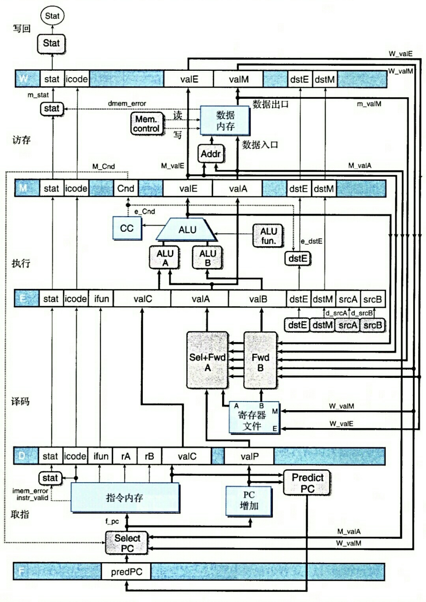

# Y86 PIPE CPU

* __项目简介__

这个项目来源于CMU的《深入理解计算机系统》第三版，书中介绍了一个类x86-64的Y86-64指令集。我们的计算机系统课的大作业要求用Verilog实现这个指令集，于是就有了这个项目。但是这个项目最终超出了作业的要求范围，我把它放到这里，作为自己的一点小成果，同时也希望能帮到有需要的人。

* __Y86-64简介__

Y86-64是一个用于教学的类x86-64的简单指令集（不是精简指令集），仅支持简单的逻辑运算和整数运算，全部指令如下：

        0x00                        halt
        0x10                        nop

        0x20rArB                    rrmovq
        0x21rArB                    cmovle
        0x22rArB                    cmovl
        0x23rArB                    cmove
        0x24rArB                    cmovne
        0x25rArB                    cmovge
        0x26rArB                    cmovg

        0x30FrB0000000000000000     irmovq
        0x31FrB0000000000000000     iaddq
        0x32FrB0000000000000000     isubq
        0x33FrB0000000000000000     iandq
        0x34FrB0000000000000000     ixorq

        0x40rArB0000000000000000    rmmovq
        0x50rArB0000000000000000    mrmovq

        0x60rArB                    addq
        0x61rArB                    subq
        0x62rArB                    andq
        0x63rArB                    xorq

        0x700000000000000000        jmp
        0x710000000000000000        jle
        0x720000000000000000        jl
        0x730000000000000000        je
        0x740000000000000000        jne
        0x750000000000000000        jge
        0x760000000000000000        jg

        0x800000000000000000        call
        0x90                        ret
        0xA0rAF                     pushq
        0xB0rAF                     popq

> 注：原书中并不包含iaddq, isubq, iandq, ixorq，这是我自己扩充的。

Y86-64共有15个64位寄存器，编号从0x0到0xE，0xF则表示不使用寄存器：

        0   rax
        1   rcx
        2   rdx
        3   rbx
        4   rsp
        5   rbp
        6   rsi
        7   rdi
        8   r8
        9   r9
        A   r10
        B   r11
        C   r12
        D   r13
        E   r14
        F   NREG

书中的Y86-64的实现有两个版本，一个顺序实现，一个流水线实现。本项目实现的是流水线版本，共5级流水线。

* __Y86五级流水简介__

Y86的指令执行被划分为五个阶段：取址、译码、执行、访存、写回。

> * 取址
>
> 根据之前的执行结果选择PC值并据此从内存中取出将要执行的指令，同时根据指令码将解析指令中的源寄存器、目的寄存器、立即数等。
>
> * 译码
>
> 根据指令码选择将要送到执行阶段的操作数，包括使用数据转发机制处理数据冒险。
>
> * 执行
>
> ALU根据指令码执行相应的计算并设置标志位和条件码。
>
> * 访存
>
> 若指令需要读写内存，则在本阶段进行。
>
> * 写回
>
> 将ALU的运算结果和访存阶段取出的数据（如果有的话）写回到目的寄存器。

* __Y86-64结构设计__

书中给出的Y86-64流水线的最终结构如图：

* __Y86-64流水线处理器模块设计__

> 除少数特例外，模块接口命名均服从以下规则：
>
>     source_name_i/o
>
> source: 信号的来源，大写字母表示流水线寄存器，小写字母表示流水线阶段
>
> name: 信号的名称，即信号代表的含义
>
> i/o: 在该模块中信号的方向，i为输入，o为输出

__核心模块__

1. 取指寄存器模块：fetch_reg

源文件：[fetch_reg.v](./y86cpu.srcs/sources_1/new/fetch_reg.v)

功能：暂存前一阶段预测的PC值，供select_pc模块使用；

接口设计：

    module fetch_reg(
        input wire clk,
        input wire rst,
        input wire F_stall_i,
        input wire [`ADDR_BUS] f_predPC_i,
        output reg [`ADDR_BUS] F_predPC_o
    );

2. 指令解析及PC预测模块：fetch

源文件：[fetch.v](./y86cpu.srcs/sources_1/new/fetch.v)

功能：解析取得的指令并根据指令码预测下一个PC；

接口设计：

    module fetch(
        input wire [`ADDR_BUS] f_pc_i,
        input wire [`INST_BUS] inst_i,
        input wire mem_error_i,

        output reg [`ICODE_BUS] f_icode_o,
        output reg [`IFUN_BUS] f_ifun_o,
        output reg [`REG_ADDR_BUS] f_rA_o,
        output reg [`REG_ADDR_BUS] f_rB_o,
        output reg [`DATA_BUS] f_valC_o,
        output reg [`ADDR_BUS] f_valP_o,
        output reg [`REG_ADDR_BUS] f_dstE_o,
        output reg [`REG_ADDR_BUS] f_dstM_o,
        output reg [`ADDR_BUS] f_predPC_o,
        output reg [`STAT_BUS] f_stat_o
    );

3. PC选择模块：select_pc

源文件：[select_pc.v](./y86cpu.srcs/sources_1/new/select_pc.v)

功能：选择PC；

接口设计：

    module select_pc(
        input wire M_Cnd_i,
        input wire [`ICODE_BUS] M_icode_i,
        input wire [`ICODE_BUS] W_icode_i,
        input wire [`ADDR_BUS] M_valA_i,
        input wire [`ADDR_BUS] W_valM_i,
        input wire [`ADDR_BUS] F_predPC_i,

        output reg [`ADDR_BUS] f_pc_o
    );

4. 译码寄存器模块：decode_reg

源文件：[decode_reg.v](./y86cpu.srcs/sources_1/new/decode_reg.v)

功能：暂存fetch模块解析出的指令信息；

接口设计：

    module decode_reg(
        input wire rst,
        input wire clk,
        input wire D_stall_i,
        input wire D_bubble_i,
        input wire [`ICODE_BUS] f_icode_i,
        input wire [`IFUN_BUS] f_ifun_i,
        input wire [`REG_ADDR_BUS] f_rA_i,
        input wire [`REG_ADDR_BUS] f_rB_i,
        input wire [`DATA_BUS] f_valC_i,
        input wire [`ADDR_BUS] f_valP_i,
        input wire [`REG_ADDR_BUS] f_dstE_i,
        input wire [`REG_ADDR_BUS] f_dstM_i,
        input wire [`STAT_BUS] f_stat_i,

        output reg [`ICODE_BUS] D_icode_o,
        output reg [`IFUN_BUS] D_ifun_o,
        output reg [`REG_ADDR_BUS] D_rA_o,
        output reg [`REG_ADDR_BUS] D_rB_o,
        output reg [`DATA_BUS] D_valC_o,
        output reg [`ADDR_BUS] D_valP_o,
        output reg [`REG_ADDR_BUS] D_dstE_o,
        output reg [`REG_ADDR_BUS] D_dstM_o,
        output reg [`STAT_BUS] D_stat_o
    );

5. 译码模块：decode

源文件：[decode.v](./y86cpu.srcs/sources_1/new/decode.v)

功能：根据指令关系决定送往执行寄存器模块的d_valA和d_valB的值；

接口设计：

    module decode(
        input wire [`ICODE_BUS]    D_icode_i,
        input wire [`ADDR_BUS]     D_valP_i,
        input wire [`REG_ADDR_BUS] D_srcA_i,
        input wire [`REG_ADDR_BUS] D_srcB_i,
        input wire [`DATA_BUS]     r_valA_i,
        input wire [`DATA_BUS]     r_valB_i,
        input wire [`REG_ADDR_BUS] e_dstE_i,
        input wire [`DATA_BUS]     e_valE_i,
        input wire [`REG_ADDR_BUS] M_dstE_i,
        input wire [`DATA_BUS]     M_valE_i,
        input wire [`REG_ADDR_BUS] M_dstM_i,
        input wire [`DATA_BUS]     m_valM_i,
        input wire [`REG_ADDR_BUS] W_dstE_i,
        input wire [`DATA_BUS]     W_valE_i,
        input wire [`REG_ADDR_BUS] W_dstM_i,
        input wire [`DATA_BUS]     W_valM_i,

        output reg [`DATA_BUS] d_valA_o,
        output reg [`DATA_BUS] d_valB_o
    );

6. 执行寄存器模块：execute_reg

源文件：[execute_reg.v](./y86cpu.srcs/sources_1/new/execute_reg.v)

功能：暂存上一阶段的指令信息；

接口设计：

    module execute_reg(
        input wire clk,
        input wire rst,
        input wire E_bubble_i,
        input wire [`STAT_BUS] D_stat_i,
        input wire [`ICODE_BUS] D_icode_i,
        input wire [`IFUN_BUS] D_ifun_i,
        input wire [`DATA_BUS] D_valC_i,
        input wire [`DATA_BUS] d_valA_i,
        input wire [`DATA_BUS] d_valB_i,
        input wire [`REG_ADDR_BUS] D_dstE_i,
        input wire [`REG_ADDR_BUS] D_dstM_i,
        input wire [`REG_ADDR_BUS] D_srcA_i,
        input wire [`REG_ADDR_BUS] D_srcB_i,

        output reg [`STAT_BUS] E_stat_o,
        output reg [`ICODE_BUS] E_icode_o,
        output reg [`IFUN_BUS] E_ifun_o,
        output reg [`DATA_BUS] E_valC_o,
        output reg [`DATA_BUS] E_valA_o,
        output reg [`DATA_BUS] E_valB_o,
        output reg [`REG_ADDR_BUS] E_dstE_o,
        output reg [`REG_ADDR_BUS] E_dstM_o
    );

7. ALU操作数判断模块：alu_args

源文件：[alu_args.v](./y86cpu.srcs/sources_1/new/alu_args.v)

功能：根据执行寄存器中的指令码和功能码决定传送给算术逻辑运算模块的值和运算类型；

接口设计：

    module alu_args(
        input wire [`ICODE_BUS] E_icode_i,
        input wire [`IFUN_BUS] E_ifun_i,
        input wire [`DATA_BUS] E_valC_i,
        input wire [`DATA_BUS] E_valA_i,
        input wire [`DATA_BUS] E_valB_i,

        output reg [`DATA_BUS] aluA_o,
        output reg [`DATA_BUS] aluB_o,
        output reg [`IFUN_BUS] fun_o
    );

8. ALU（算术逻辑运算模块）：alu

源文件：[alu.v](./y86cpu.srcs/sources_1/new/alu.v)

功能：根据alu_args模块的输出执行相应的计算并设置标志位寄存器；

接口设计：

    module alu(
        input wire [`DATA_BUS] aluA_i,
        input wire [`DATA_BUS] aluB_i,
        input wire [`IFUN_BUS] fun_i,

        output reg [`DATA_BUS] e_valE_o,
        output reg ZF_o,
        output reg SF_o,
        output reg OF_o
    );

9. 条件码设置模块：set_cond

源文件：[set_cond.v](./y86cpu.srcs/sources_1/new/set_cond.v)

功能：设置条件码并确定条件转移指令的目的寄存器；

接口设计：

    module set_cond(
        input wire set_cc_i,
        input wire [`ICODE_BUS] E_icode_i,
        input wire [`IFUN_BUS] E_ifun_i,
        input wire [`REG_ADDR_BUS] E_dstE_i,
        input wire ZF_i,
        input wire SF_i,
        input wire OF_i,

        output reg e_Cnd_o,
        output reg [`REG_ADDR_BUS] e_dstE_o
    );

10. 访存寄存器模块：mem_reg

源文件：[mem_reg.v](./y86cpu.srcs/sources_1/new/mem_reg.v)

功能：暂存上一阶段的指令信息；

接口设计：

    module mem_reg(
        input wire clk,
        input wire rst,
        input wire e_Cnd_i,
        input wire M_bubble_i,
        input wire [`STAT_BUS] E_stat_i,
        input wire [`ICODE_BUS] E_icode_i,
        input wire [`DATA_BUS] e_valE_i,
        input wire [`DATA_BUS] E_valA_i,
        input wire [`REG_ADDR_BUS] e_dstE_i,
        input wire [`REG_ADDR_BUS] E_dstM_i,

        output reg M_Cnd_o,
        output reg [`STAT_BUS] M_stat_o,
        output reg [`ICODE_BUS] M_icode_o,
        output reg [`DATA_BUS] M_valE_o,
        output reg [`DATA_BUS] M_valA_o,
        output reg [`REG_ADDR_BUS] M_dstE_o,
        output reg [`REG_ADDR_BUS] M_dstM_o
    );

11. 访存模块：mem

源文件：[mem.v](./y86cpu.srcs/sources_1/new/mem.v)

功能：确定访存操作（读/写）和需要访问的地址；

接口设计：

    module mem(
        input wire [`DATA_BUS] M_valE_i,
        input wire [`DATA_BUS] M_valA_i,
        input wire [`ICODE_BUS] M_icode_i,

        output reg [`ADDR_BUS] addr,
        output reg write
    );

12. 访存阶段状态码设置模块：set_m_stat

源文件：[set_m_stat.v](./y86cpu.srcs/sources_1/new/set_m_stat.v)

功能：根据访存结果设置访存阶段的状态码；

接口设计：

    module set_m_stat(
        input wire [`STAT_BUS] M_stat_i,
        input wire mem_error_i,

        output reg [`STAT_BUS] m_stat_o
    );

13. 写回寄存器模块：write_reg

源文件：[write_reg.v](./y86cpu.srcs/sources_1/new/write_reg.v)

功能：暂存上一阶段的指令信息；

接口设计：

    module write_reg(
        input wire clk,
        input wire rst,
        input wire W_stall_i,
        input wire [`STAT_BUS] m_stat_i,
        input wire [`ICODE_BUS] M_icode_i,
        input wire [`DATA_BUS] M_valE_i,
        input wire [`DATA_BUS] m_valM_i,
        input wire [`REG_ADDR_BUS] M_dstE_i,
        input wire [`REG_ADDR_BUS] M_dstM_i,

        output reg [`STAT_BUS] W_stat_o,
        output reg [`ICODE_BUS] W_icode_o,
        output reg [`DATA_BUS] W_valE_o,
        output reg [`DATA_BUS] W_valM_o,
        output reg [`REG_ADDR_BUS] W_dstE_o,
        output reg [`REG_ADDR_BUS] W_dstM_o
    );

14. 通用寄存器模块：registers

源文件：[registers.v](./y86cpu.srcs/sources_1/new/registers.v)

功能：处理器的通用寄存器模块；

接口设计：

    module registers(
        input wire clk,
        input wire rst,
        input wire [`REG_ADDR_BUS]W_dstM_i,
        input wire [`REG_ADDR_BUS]W_dstE_i,
        input wire [`DATA_BUS]W_valM_i,
        input wire [`DATA_BUS]W_valE_i,
        input wire [`REG_ADDR_BUS]D_rA_i,
        input wire [`REG_ADDR_BUS]D_rB_i,

        output reg [`DATA_BUS]r_valA_o,
        output reg [`DATA_BUS]r_valB_o
    );

15. 流水线控制逻辑模块：controller

源文件：[controller.v](./y86cpu.srcs/sources_1/new/controller.v)

功能：控制流水线运作，插入气泡或暂停流水线；

接口设计：

    module controller(
        input wire [`ICODE_BUS] D_icode_i,
        input wire [`REG_ADDR_BUS] D_rA_i,
        input wire [`REG_ADDR_BUS] D_rB_i,
        input wire [`ICODE_BUS] E_icode_i,
        input wire [`REG_ADDR_BUS] E_dstM_i,
        input wire e_Cnd_i,
        input wire [`ICODE_BUS] M_icode_i,
        input wire [`STAT_BUS] m_stat_i,
        input wire [`STAT_BUS] W_stat_i,

        output reg F_stall_o,
        output reg D_bubble_o,
        output reg D_stall_o,
        output reg E_bubble_o,
        output reg set_cc_o,
        output reg M_bubble_o,
        output reg W_stall_o
    );

__外围模块__

1. 指令内存模块：i_mem

源文件：[i_mem.v](./y86cpu.srcs/sources_1/new/i_mem.v)

功能：存储程序指令；

接口设计：

    module i_mem(
        input wire [`ADDR_BUS] addr,
        output reg [`INST_BUS] inst,
        output reg error
    );

2. 数据内存模块：d_mem.v

源文件：[d_mem.v](./y86cpu.srcs/sources_1/new/d_mem.v)

功能：存储程序数据；

端口设计：

    module d_mem(
        input wire clk,
        input wire rst,
        input wire write,
        input wire [`ADDR_BUS] addr,
        input wire [`DATA_BUS] data_i,

        output reg [`DATA_BUS] data_o,
        output reg error
    );

__其他文件说明__

* [define.v](./y86cpu.srcs/sources_1/new/define.v)

全局宏定义

* [y86cpu.v](./y86cpu.srcs/sources_1/new/y86cpu.v)

第一层模块封装，将全部核心模块封装为cpu模块，留出时钟接口、重置接口以及内存IO接口

* [sopc.v](./y86cpu.srcs/sources_1/new/sopc.v)

第二层模块封装，将cpu模块和外围模块封装为sopc模块，留出时钟和重置接口

* [sopc_tb.v](./y86cpu.srcs/sim_1/new/sopc_tb.v)

TestBench模块，用于模拟仿真

* [insts.data](./y86cpu.srcs/sim_1/new/insts.data)

用于仿真的机器指令，用16进制表示，每行表示一个字节，在i_mem模块中使用$readmemh读取文件内容以初始化指令内存

* [asum.yo](./y86cpu.srcs/sim_1/new/asum.yo)

上述机器指令的汇编版本，来自于原书课后作业的配套材料